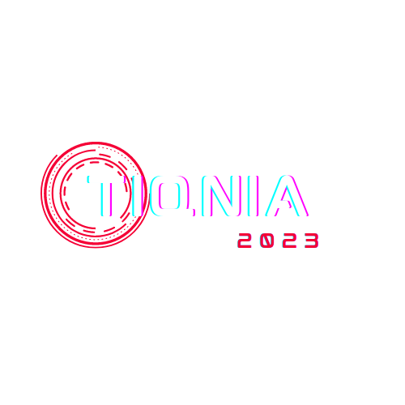

# TIQNIA2023 - IT Fest Website :computer:

# Welcome to the TIQNIA2023 Website Repository! :tada:

### Created by  [Rishwal](https://github.com/rishwal) with HTML, CSS, and JQuery :rocket:

## Table of Contents :scroll:

- [Introduction](#introduction)
- [Key Features](#key-features)
- [Event Details](#event-details)
- [About Us](#about-us)
- [Department of Computer Applications](#department-of-computer-applications)
- [Our Partners](#our-partners)
- [Registration](#registration)
- [Contact Us](#contact-us)

## Introduction :wave:

Welcome to the repository for the official website of TIQNIA2023 - the IT Fest organized by WMO IG Arts and Science College, Wayanad! :school:

## Key Features :star:

- **Simple and Responsive Design**: Created using HTML, CSS, and JQuery.
- **Event Information**: Details about the fest, schedule, and participating departments.
- **Event Registration**: Easy registration process for participants.
- **Event Showcase**: Information about various events with attractive visuals.

## Event Details :calendar:

### TIQNIA2023 - IT Fest Schedule :alarm_clock:

- **Date**: 23rd February 2023
- **Location**: Kappumchal, Wayanad
- **Venue**: WMO IG Arts & Science College

For more details, check out the [official event page](https://rishwal.github.io/tiqnia) :link:

## About Us :information_source:

The IT Fest of WMO IG Arts and Science College, Kappumchal Panamaram, is an exciting event showcasing talents in the field of Information Technology. Conducted by the Department of Computer Applications, this fest will feature 8 different events testing students' technical skills and creativity.

## Department of Computer Applications :desktop_computer:

The Department of Computer Applications at WMO IG Arts and Science College is dedicated to providing comprehensive education in computer applications and information technology. The upcoming IT Fest, Tiqnia2023, will be held on 23rd February 2023 and organized entirely by the students of the BCA department.

# Our Sponsors

We are proud to be associated with the following partners and sponsors:

- ## [Vazhikatti](https://www.instagram.com/vazhikatti__86/)
  

- ## [Lyfizy Group](https://www.instagram.com/lyfizy_group/)
  

- ## [Le Ocio](https://www.instagram.com/le_ocio_/)
  

- ## [Kattumadam Marbles](https://instagram.com/kattumadam_marbles?igshid=YmMyMTA2M2Y=)
  

- ## [Tiqnia2023](https://www.instagram.com/tiqnia2023/)
  

## Registration :clipboard:

Ready to participate? Register for TIQNIA2023 now! :point_down:

[Register Here](https://forms.gle/t6vWyAET3kV4boHd7) :link:

## Contact Us :email:

For any inquiries or assistance, feel free to reach out to our team:

- **Rishwal**: [+91-9633216991](tel:+91-9633216991)
- **Nifan**: [+91-9526110811](tel:+91-9526110811)
- **Asif**: [+91-8129763260](tel:+91-8129763260)
- **Mubaseer**: [+91-9061874787](tel:+91-9061874787)

- **Email**: [tiqnia2023@gmail.com](mailto:tiqnia2023@gmail.com)

## Contributing :handshake:

I welcome contributions from the community! If you'd like to contribute to the TIQNIA2023 website, follow these steps:

1. Fork this repository.
2. Create a new branch: `git checkout -b feature/new-feature`.
3. Make your changes and commit them: `git commit -m 'Add new feature'`.
4. Push to the branch: `git push origin feature/new-feature`.
5. Open a pull request.

## We are looking forward to seeing you at TIQNIA2023! :rocket:
